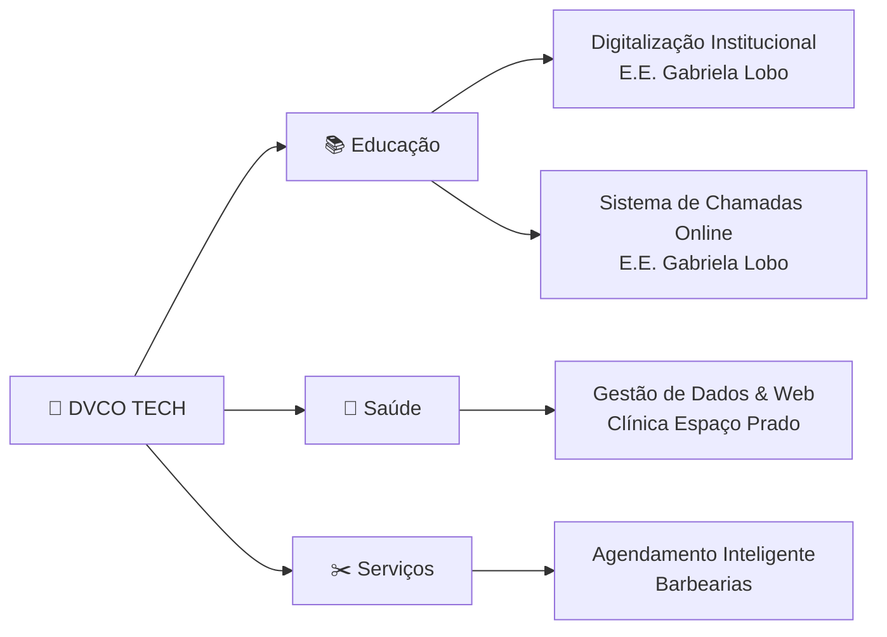

<div align="center">


<br/>

```
  ██████╗ ██╗   ██╗ ██████╗ ██████╗     ████████╗███████╗ ██████╗██╗  ██╗
  ██╔══██╗██║   ██║██╔════╝██╔═══██╗    ╚══██╔══╝██╔════╝██╔════╝██║  ██║
  ██║  ██║██║   ██║██║     ██║   ██║       ██║   █████╗  ██║     ███████║
  ██║  ██║╚██╗ ██╔╝██║     ██║   ██║       ██║   ██╔══╝  ██║     ██╔══██║
  ██████╔╝ ╚████╔╝ ╚██████╗╚██████╔╝       ██║   ███████╗╚██████╗██║  ██║
  ╚═════╝   ╚═══╝   ╚═════╝ ╚═════╝        ╚═╝   ╚══════╝ ╚═════╝╚═╝  ╚═╝
```

### ✦ *Soluções inteligentes em Business Intelligence, Automação e Desenvolvimento Web* ✦

<br/>

[](https://git.io/typing-svg)

<br/>


</div>

---

<br/>

## ⚡ O Que Fazemos

<table>
<tr>
<td width="33%" align="center">

### 📊 Business Intelligence
Dashboards estratégicos que transformam dados brutos em insights que movem negócios. Decisões mais rápidas, resultados mais claros.

</td>
<td width="33%" align="center">

### 🤖 Automação de Processos
Bots para WhatsApp, fluxos inteligentes com **n8n** e infraestrutura escalável com **Docker**. Zero esforço manual onde é possível.

</td>
<td width="33%" align="center">

### 🌐 Desenvolvimento Web
Sites institucionais modernos e sistemas de gestão sob medida. Da landing page ao sistema completo.

</td>
</tr>
</table>

<br/>

---

## 🏆 Cases de Sucesso



<br/>

<div align="center">

| Setor | Projeto | Impacto |
|:---:|:---|:---:|
| 📚 **Educação** | Digitalização institucional — E.E. Gabriela Lobo | `Gestão modernizada` |
| 📚 **Educação** | Sistema de chamadas online — E.E. Gabriela Lobo | `+Eficiência operacional` |
| 🏥 **Saúde** | Gestão de dados e presença web — Clínica Espaço Prado | `Presença digital sólida` |
| ✂️ **Serviços** | Sistema de agendamento inteligente — Barbearias | `Automação de agendas` |

</div>

<br/>

---

## 🛠️ Stack Tecnológica

<div align="center">

**Infrastructure & Automation**


**Data & Intelligence**


**Frontend & Web**


**Communication & Bots**


</div>

<br/>

---

## 💡 Nossa Filosofia

<div align="center">

```
┌─────────────────────────────────────────────────────────────────┐
│                                                                   │
│   "Não entregamos apenas tecnologia — entregamos transformação.  │
│    Cada linha de código resolve um problema real.                 │
│    Cada dashboard revela uma oportunidade escondida.             │
│    Cada automação libera potencial humano para o que importa."   │
│                                                                   │
│                                          — DVCO TECH             │
└─────────────────────────────────────────────────────────────────┘
```

</div>

<br/>

---

## 🤝 Vamos Conversar?

<div align="center">

Tem um desafio de dados, processo manual irritante ou projeto digital em mente?

**A DVCO TECH quer ouvir você.**

<br/>

[](https://linkedin.com)
[](https://wa.me)
[](mailto:contato@dvcotech.com.br)
[](https://dvcotech.com.br)

<br/>


</div>

